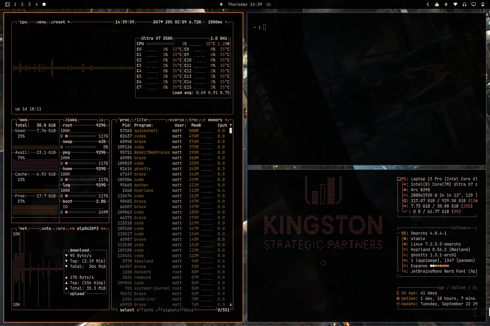
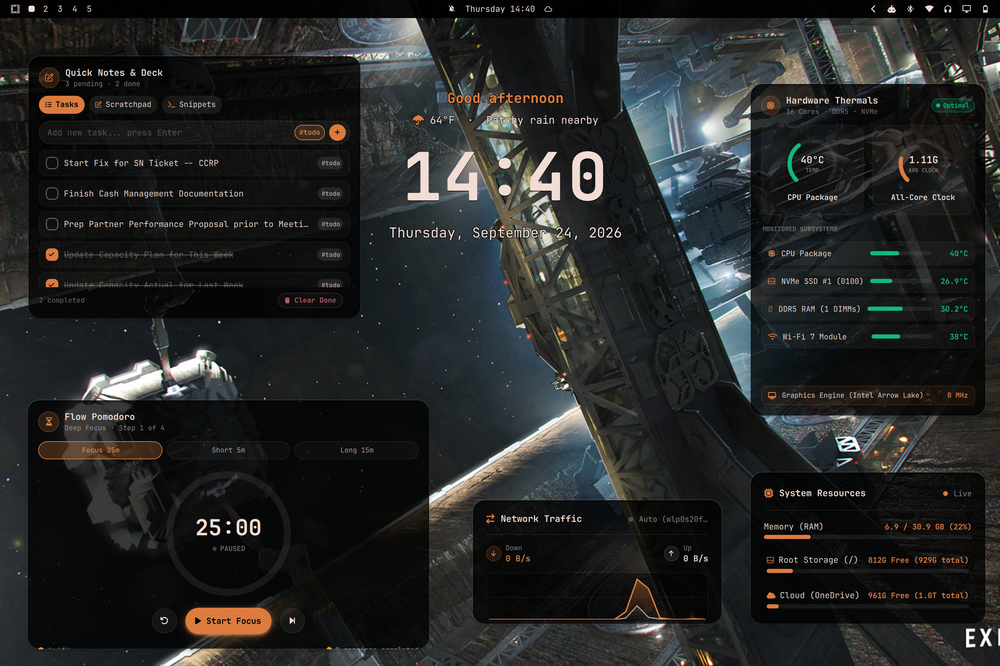
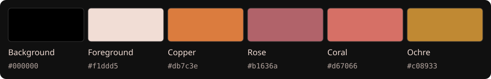
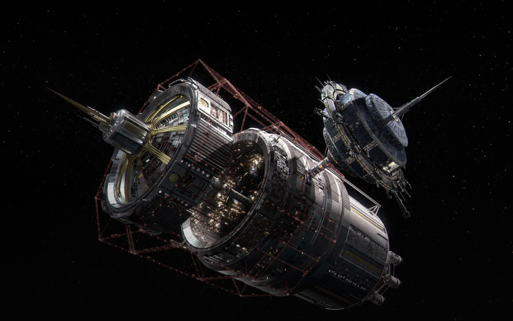
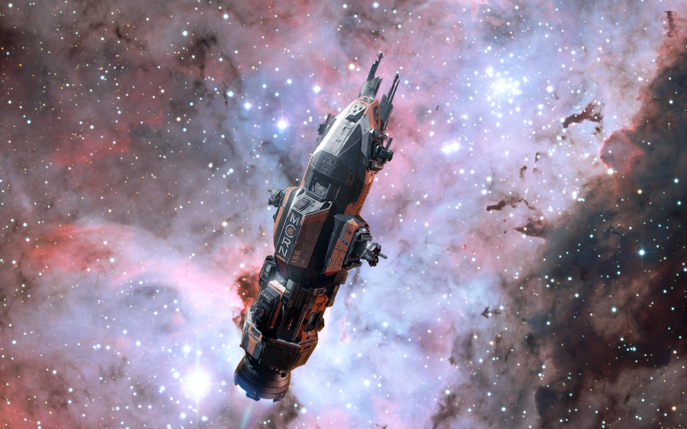
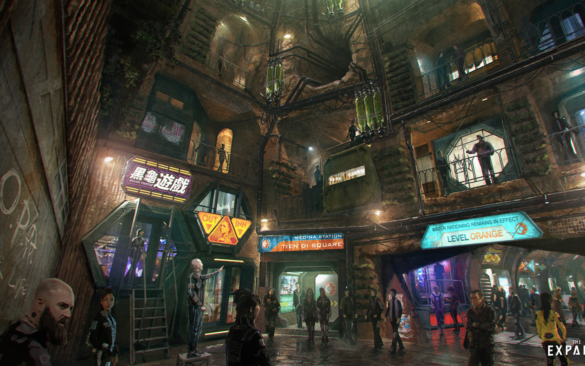
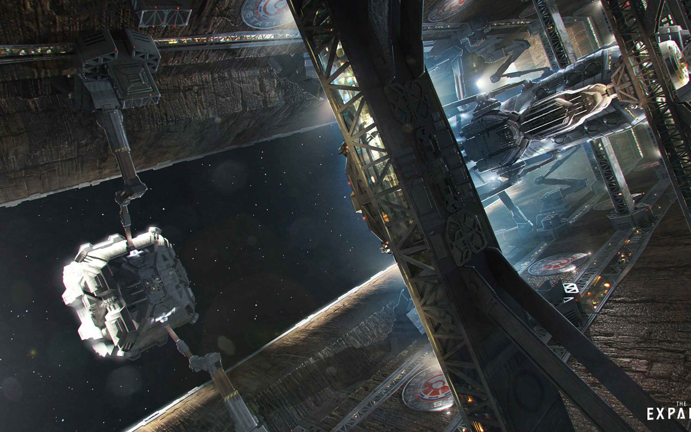
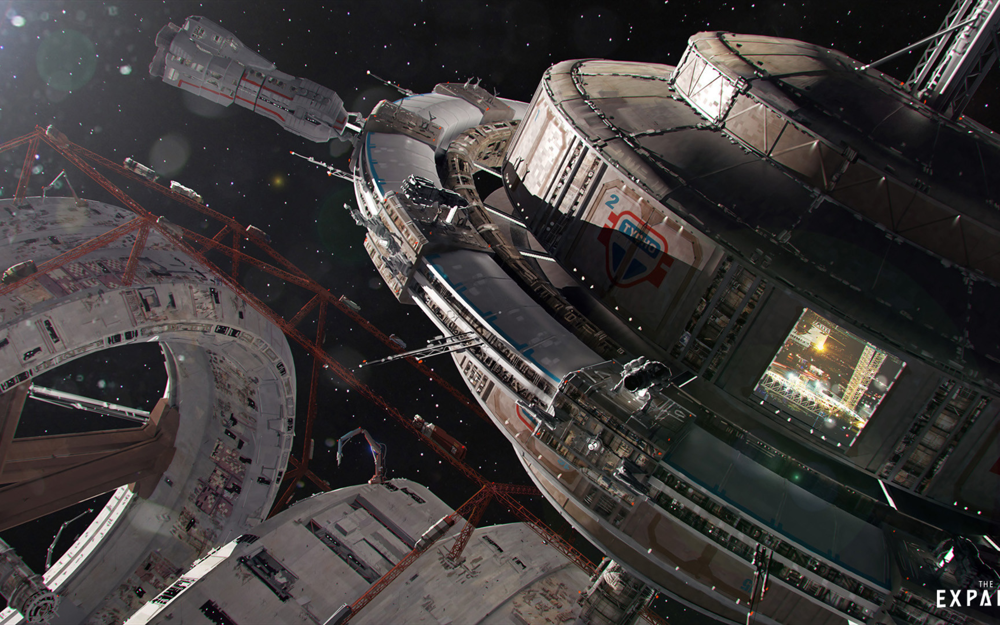
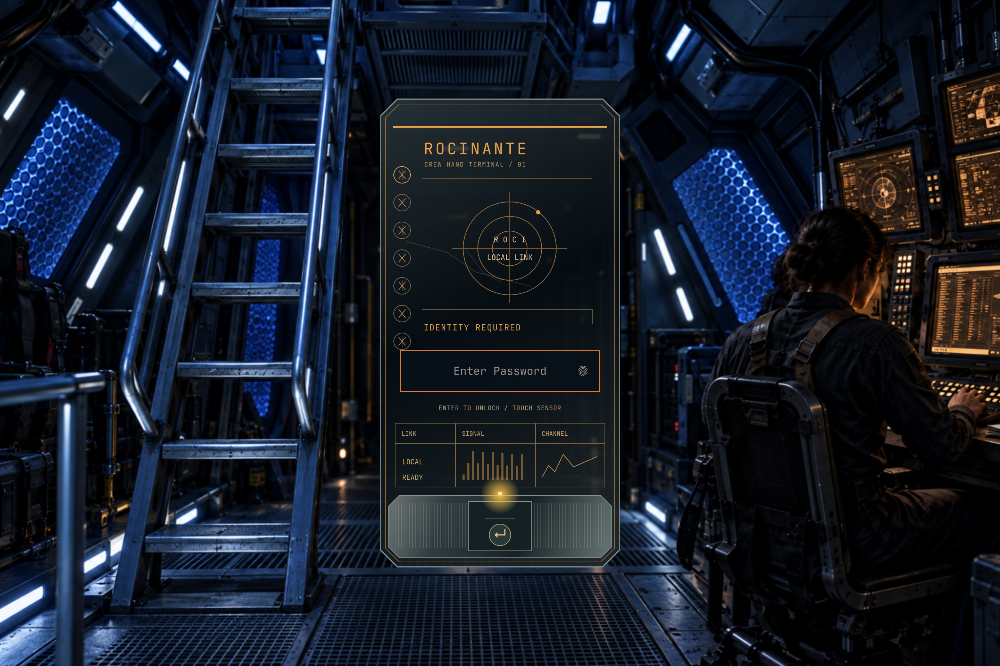

# Expanse for Omarchy

Deep space black, copper highlights, and warm peach text. A dark Omarchy theme
inspired by *The Expanse*, with an analogous palette from Aether and just enough
transparency to let the artwork show through.

## Preview





The screenshots show a customized desktop. Desktop widgets and the optional
window transparency setup are not installed by the theme itself.

## The look

- Copper orange accents with dusty rose, coral, and ochre supporting colors.
- Warm text on black, with a distinct gray text-selection background, including in VS Code.
- Subtly translucent bar, menus, popups, and notifications.
- Seven 2880 × 1800 wallpapers, with the original spacecraft image first.
- Optional Rocinante lock screen with an illuminated hand-terminal password interface.
- Colors generated through Omarchy’s app templates; no bundled terminal or editor executables.



| Role | Color |
| --- | --- |
| Background | `#000000` |
| Foreground | `#f1ddd5` |
| Selection background | `#606060` |
| Accent | `#db7c3e` |
| Rose | `#b1636a` |
| Coral | `#d67066` |
| Ochre | `#c08933` |

## Install

Requires an Omarchy version that supports `colors.toml` and
`shell.<section>.toml` theme overrides. Prepared against the Omarchy v4 theme
format.

```sh
omarchy theme install https://github.com/mcsmith3/omarchy-expanse-theme
```

Select **Expanse** in the theme picker, or apply it from a terminal:

```sh
omarchy theme set expanse
```

The icon preference is `Yaru-wartybrown`; it requires that icon theme to be
installed on your system.

## Wallpapers

Cycle through the collection:

```sh
omarchy theme bg next
```

| Deep space · default | Planetfall | Nebula |
| :---: | :---: | :---: |
|  |  |  |
| **Outside the airlock** | **Station streets** | **Dockside** |
|  |  |  |

<p align="center"><br><em>Approach</em></p>

All wallpapers retain their original pixels. They use a 16:10 aspect ratio;
displays with a different shape may crop the edges when filling the screen.
Gallery names are descriptive labels, not verified artwork titles.

## Rocinante lock screen



The optional lock screen combines a generated Rocinante interior with a native
interface inspired by Miller's illuminated hand terminal: chamfered glass,
amber engraving, a ribbed control base, and a working password field.
Password checking and fingerprint authentication use Omarchy's existing locker.

Install the theme first, then run the optional installer **while unlocked**:

```sh
python3 ~/.config/omarchy/themes/expanse/scripts/install-lock-screen.py --check
python3 ~/.config/omarchy/themes/expanse/scripts/install-lock-screen.py
omarchy restart shell
```

This requires **Omarchy Shell's lock plugin**, not Hyprlock. Installing the theme
alone adds the artwork; the explicit installer enables the custom lock layout.
Other themes retain their usual password field and wallpaper. Desktop wallpaper
cycling stays independent. See [setup, compatibility, and removal](docs/lock-screen.md).

## A hint of transparency

The bar uses **94% background opacity**. Menus, popups, and notifications use
**96%**. Shell text remains fully opaque. The launcher keeps Omarchy’s generated
95% background opacity.

Window transparency and blur are optional: see [the local setup guide](docs/transparency.md)
for 96% focused windows, 93% unfocused windows, and a light blur. Omarchy
regenerates executable theme files for repository-installed themes, so these
window settings are deliberately kept in your own Hyprland configuration.

## Make it yours

`colors.toml` is the palette source. `shell.bar.toml`, `shell.menu.toml`,
`shell.popups.toml`, and `shell.notifications.toml` retain complete shell
sections with transparency settings. Their literal colors should be updated
alongside the palette. `vscode-theme.json` is an Omarchy-generated palette snapshot
with stronger gray selections for VS Code and its integrated terminal. Update
its colors alongside palette changes as well. Reapply the theme after editing.

For personal wallpapers, use `~/.config/omarchy/backgrounds/expanse/` so they
remain separate from the repository. Back up theme edits before pulling updates
or reinstalling. Omarchy’s installer replaces an existing theme of the same name.

## Credits and license

Palette generated with Aether’s analogous option from the original spacecraft
wallpaper, with a selection-text contrast adjustment. Built for
[Omarchy](https://omarchy.org/) and inspired by *The Expanse*.

This is an unofficial fan theme, with no affiliation or endorsement implied.
Theme configuration and documentation are [MIT licensed](LICENSE).
Wallpaper images are excluded from that license; see [artwork credits](ARTWORK.md).
