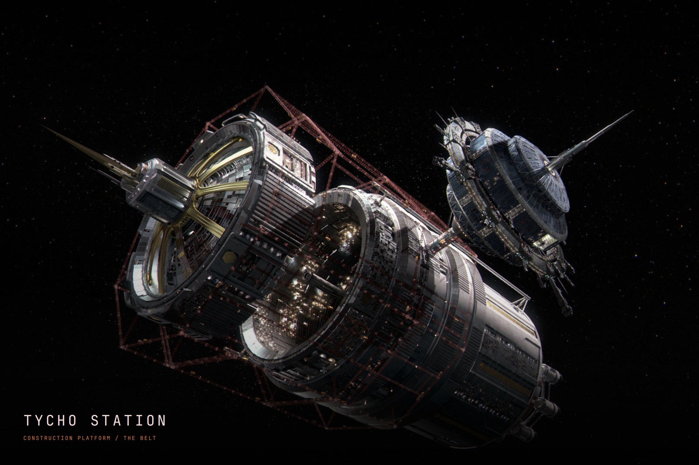
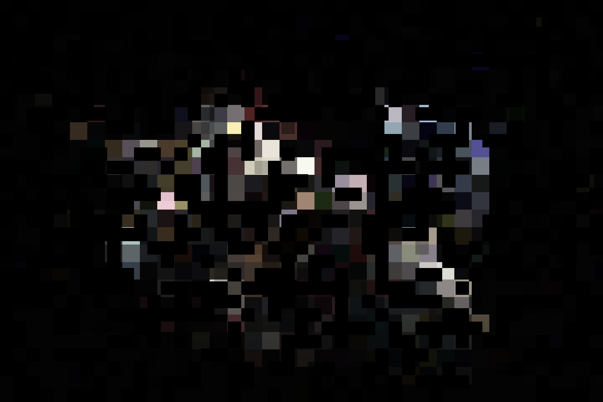

# Full-screen Expanse screensaver

The screensaver runs as a separate Quickshell application, using cinematic
artwork and a GPU pixel-dissolve shader. It cycles through the Rocinante, Tycho
Station, the Nauvoo, and the Ring Gate. It needs no video player or network
connection after installation.

Tycho uses an unchanged copy of `backgrounds/00-expanse2.png`, selected by the
theme maintainer as the actual station image from the show. The other three
scenes are generated artwork.



## Install and preview

Requires Omarchy Shell with the supported idle plugin, Quickshell 0.3 or later,
and Python 3 for installation. The shader is precompiled; `qsb` is only required
if you edit the shader source. Run while unlocked:

```sh
python3 ~/.config/omarchy/themes/expanse/scripts/install-screensaver.py --check
python3 ~/.config/omarchy/themes/expanse/scripts/install-screensaver.py
omarchy restart shell
```

From a development checkout, use `python3 scripts/install-screensaver.py` instead.
The optional installer copies the assets to
`~/.local/share/omarchy-expanse/org.omarchy.screensaver/` and installs the launcher
alongside that directory. Updating the theme does not automatically overwrite
the installed runtime; rerun the installer to apply future changes.

Preview immediately, including when another theme is selected:

```sh
~/.local/share/omarchy-expanse/launch-screensaver --preview
```

For a preview that exits automatically after 30 seconds:

```sh
EXPANSE_PREVIEW_SECONDS=30 ~/.local/share/omarchy-expanse/launch-screensaver --preview
```

Keyboard input, mouse motion, clicking, scrolling, or switching applications
dismisses the saver. There is a short initial mouse-motion grace period to
avoid dismissing it as its windows appear. Clicks and keyboard input work
immediately. Omarchy's existing Style → Screensaver preview still opens its
stock text-effect saver; use the command above to preview this one.

## Theme and lock behavior

The installer clones `omarchy.idle` through Omarchy's plugin CLI, backs it up,
and changes only its screensaver launch command. It retains the current
installed idle service's timing, idle inhibitors, stay-awake handling, wake
behavior, and lock deadline. No packaged Omarchy files are edited. Existing
unrelated local idle-service modifications cause a preflight refusal.

The launcher checks `~/.local/state/omarchy/current/theme.name` each time:

- Expanse uses this slideshow.
- Other themes use `omarchy-launch-screensaver` as before.
- The screensaver-off preference is respected except during explicit previews.
- An already locked session is left alone.
- Missing artwork falls back to the stock screensaver.

The window class is `org.omarchy.screensaver`, so the stock idle service can
track window opening and dismissal. The process path contains that identifier
as well, so `omarchy-system-lock` closes the saver when locking. This application
does **not** lock the session or accept passwords; your existing locker does.
One full-screen window is requested per connected monitor. Live QA was performed
on a single monitor; multi-monitor placement still depends on the compositor.

Prepared against the Omarchy idle service installed on 2026-09-25. The installer
validates the source structure before editing. Local plugin clones remain
snapshots, so review upstream idle-service updates before refreshing the clone.

## Animation

Each approximately 19-second scene includes a 3.2-second pixel assembly,
12-second hold, and 2.6-second dissolve, plus brief black intervals. The effect
combines coarse texture sampling with a stable randomized block mask. Only
transitions animate; the full-detail hold does not run a continuous frame timer.
Images fill the screen with aspect-preserving edge cropping.



Durations and captions are in `screensaver/shell.qml`. The GLSL shader source is
`screensaver/pixel-dissolve.frag`. After editing the shader, rebuild it with:

```sh
/usr/lib/qt6/bin/qsb --glsl '100 es,120,150' --hlsl 50 --msl 12 \
  -o screensaver/pixel-dissolve.frag.qsb screensaver/pixel-dissolve.frag
```

Reinstall after edits. Generation prompts sit beside the QML; reference credits
are in [ARTWORK.md](../ARTWORK.md).

## Remove

With `<username>` replaced by your login name:

```sh
omarchy plugin disable <username>.idle
```

That restores the stock idle service. The runtime files and timestamped backups
under `~/.local/state/omarchy/backups/` remain available. The Expanse lock-screen
plugin is separate and is unaffected.
